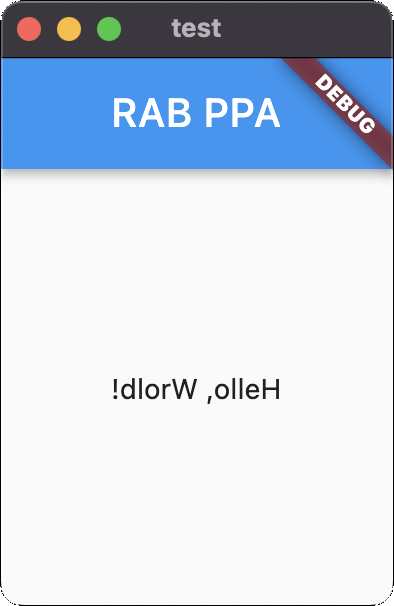

<div align="center" >

# Rettulf

### *!esrever ni stegdiw etirW*

## Getting started

</div>

```dart
import 'package:rettulf/rettulf.dart';

class MyApp extends StatelessWidget {
  const MyApp({super.key});

  @override
  Widget build(BuildContext context) =>
          "!dlorW ,olleH"
          .text()
          .padAll(50)
          .center()
          .scaffold(appBar: "RAB PPA".text().appBar())
          .materialApp(title: "Rettulf");
}
```

<div align="center" >



</div>

## Additional information

I don't want to be overwhelmed by the verbose syntax from dart, so I made this.

Rettulf is not only a package but also a philosophy of programming.

  